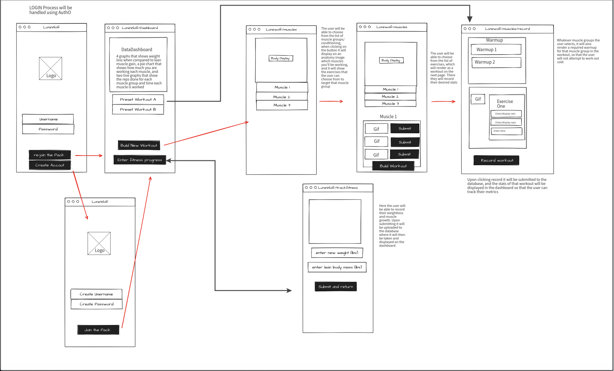
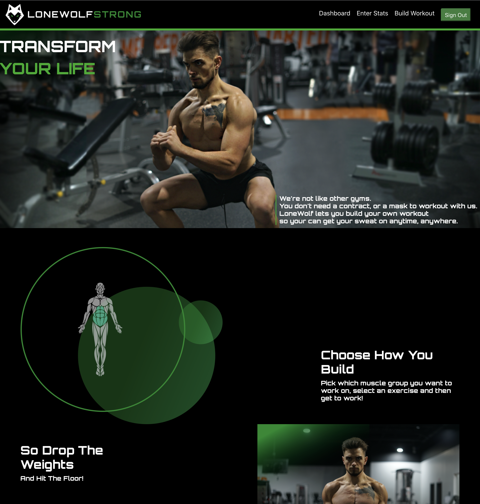
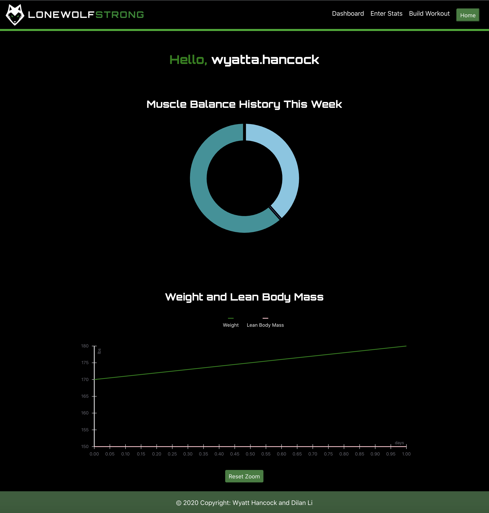
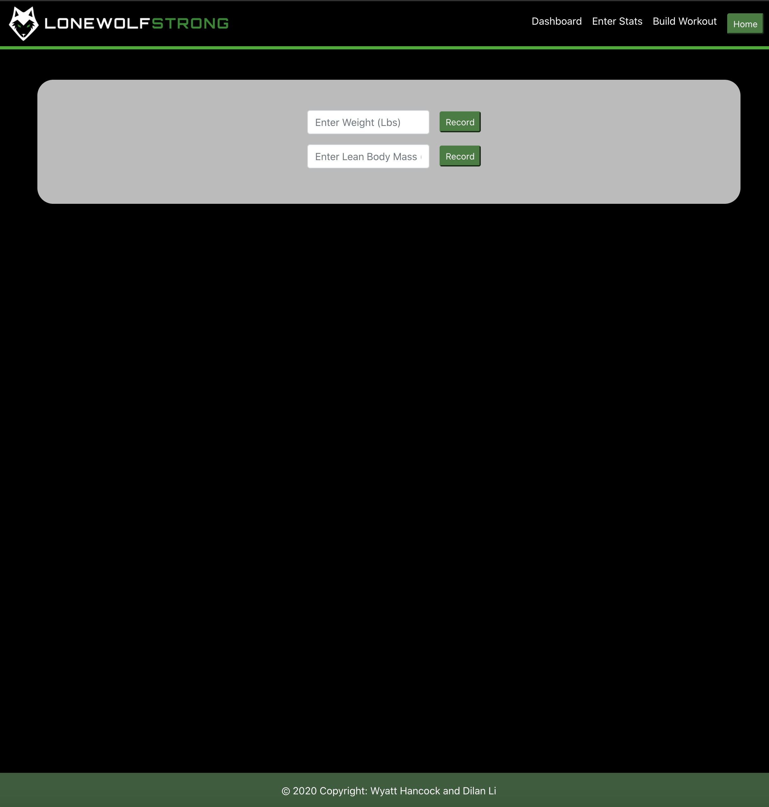
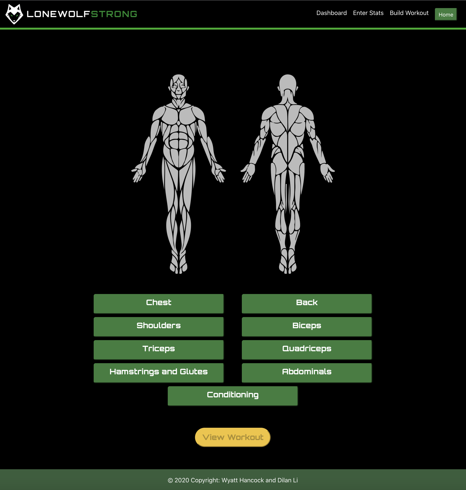
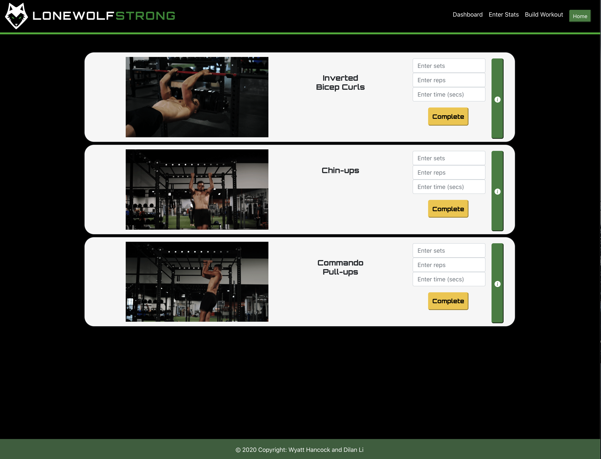

# LoneWolf

# Table of Contents
1. [Description](#Description)
2. [Elevator Pitch](#Elevator_Pitch)
3. [User Story](#User_Story)
4. [Team](#Team)
5. [Credits](#Credits)
6. [Issues and Resolutions](#Issues_And_Resolutions)
7. [Future Development](#Future_Development)
8. [Wireframe](#Wireframe)
9. [Link](#Link)
10. [Screenshots](#Screenshots)

## Description 

## Elevator_Pitch
Covid has had a variety of impacts on everyone. For some of us, the results can be seen by what is called the “covid-20”. You want to get back in shape, but with gyms being high risk infection areas and the cost of home-gym equipment skyrocketing, it can feel like your fitness goals are out of reach. LoneWolfStrong aims to fix this problem. A mobile-first website, we allow the user to create their own custom bodyweight program with guided walkthroughs. Our application lets the user track multiple facets of their fitness. First they can see which muscles they are targeting throughout their week, their long-term weight management goals and personal records, all from the comfort of their home.

## User_Story 
As an enduser
I want to be able to log into a mobile first application. 
When I am logged in, I want to be able to create a custom bodyweight workout so that I can achieve my fitness goals from home. After creating the workout and recording my results, I want to be able to track my progress on a data dashboard. This data dashboard should also allow me to see what progress I have made in my weight goals. 

## Team
1. Front End 
    * [Wyatt Hancock](https://github.com/corvus-cyber)  
2. Backend
    * [Dilan Li](https://github.com/DilanLi)

## Credits 
- [Autho: which serves as the route through which our users log in](https://auth0.com/)
- [ReactStrap: which allowed us to build react-friendly toggles and displays](https://reactstrap.github.io/)
- [React-Vis: which allowed us to build our data dashboard so that users could track their progress](https://uber.github.io/react-vis/)

## Issues_And_Resolutions 

## Future_Development
* Add preset workout options for people who just want to get started
* Add more exercise options and allow the user to target specific areas of a desired muscle (mid or rear delt, upper or lower chest, etc.).
* Add a way for the user to store and see progress pictures of themselves as an incentive to keep up the hard work. 
* Improve the lighting on some of the gifs so that they’ll be easier for the user to watch 

## Wireframe:

## Link: 

## Screenshots: 

